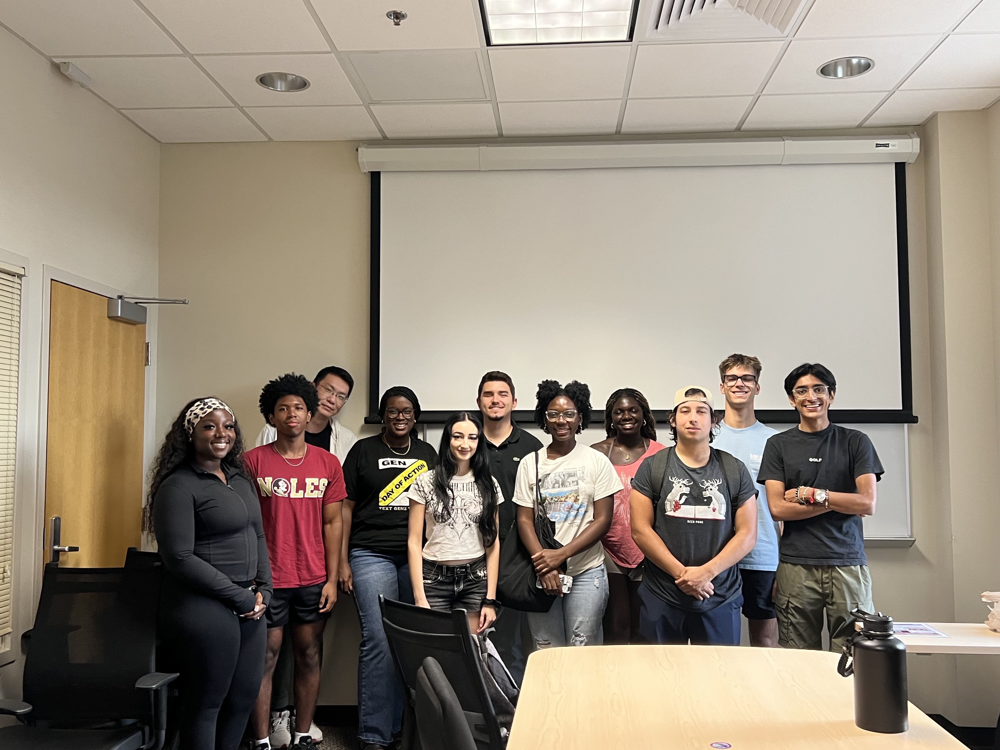

Led a two-part workshop, the first part being an quickly ramping introduction to Python for general data science, and the second part including a tutorial on bootstrap hypothesis testing for neural data science, which referenced the Kramer and Eden book on the topic. Received compliments from 4th year Neuroscience Ph.D. student Yicheng Zheng on delivery.

